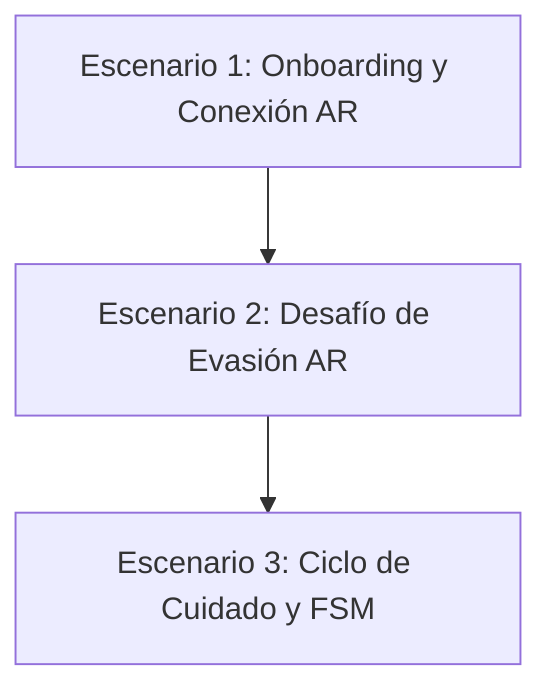

# Plan Metodológico para Pruebas de Usuario: RoboPet

Este documento establece la metodología y los escenarios de prueba recomendados para evaluar la experiencia de usuario (UX) del prototipo RoboPet. El objetivo es estructurar una validación empírica y rigurosa que cumpla con los requisitos metodológicos del curso y solucione las inconsistencias de tiempos de decaimiento identificadas en la documentación previa.

---

## 1. Protocolo y Rigor Metodológico

Para cumplir con las pautas teóricas del proyecto (Modelo 5x5 y HMSAM/TAM/IMI), la sesión de pruebas debe seguir este protocolo estructurado:

*   **Consentimiento y Pre-Test:** Explicar el propósito de la prueba sin dar detalles específicos de las mecánicas. El usuario responde el **Pre-Test** (expectativas en tiempo futuro) y se registran sus datos demográficos (correo electrónico obligatorio para validación).
*   **Técnica de *Thinking Aloud* (Pensamiento en Voz Alta):** Se le pide al usuario que verbalice en tiempo real sus pensamientos, frustraciones, sorpresas y expectativas a medida que avanza por los escenarios.
*   **Registro Visual Obligatorio:** Grabar al usuario interactuando con el dispositivo (captura de pantalla + video del usuario tomado desde su espalda/perfil para resguardar la identidad del rostro pero capturar su lenguaje corporal y el entorno físico de la interacción AR).
*   **Post-Test y Cuestionario Cualitativo:** Inmediatamente al finalizar, el usuario responde el **Post-Test** (experiencia real en tiempo pasado) en escala Likert, incluyendo al menos una pregunta abierta por cada una de las 5 dimensiones evaluadas:
    1.  *Usabilidad* (TAM/SUS)
    2.  *Intención de Uso e Utilidad Percibida* (TAM)
    3.  *Competencia Percibida* (IMI)
    4.  *Autonomía e Interacción* (IMI)
    5.  *Inmersión e Involucramiento Hedónico* (HMSAM - Absorción Cognitiva)

---

## 2. Guía Paso a Paso para la Sesión en la Universidad (Flujo de Ejecución)

Cuando vayas a realizar las pruebas presenciales, seguí este orden cronológico estricto con cada participante para asegurar la validez metodológica:

```
PASO 1: Consentimiento y Pre-Test (Google Forms)
       │
       ▼
PASO 2: Preparación y Grabación (Iniciar captura de pantalla/video)
       │
       ▼
PASO 3: Ejecución de la App (Escenarios 1, 2 y 3 en orden lineal)
       │
       ▼
PASO 4: Cierre y Post-Test (Google Forms - Cuantitativo + Cualitativo)
```

### Detalle de cada paso:
1.  **Paso 1: Bienvenida y Pre-Test (Duración: ~3-5 min)**
    *   Sentá al usuario y dale una breve bienvenida.
    *   Explicá de qué se trata el estudio de forma general (evaluar una mascota virtual conversacional en realidad aumentada). *No expliques cómo ganar el minijuego ni cómo cuidar al robot; el usuario debe descubrirlo.*
    *   Hacé que complete el consentimiento y el **Pre-Test** en el formulario web.
2.  **Paso 2: Preparación Técnica (Duración: ~1 min)**
    *   Entregale el teléfono móvil Android de prueba.
    *   Iniciá la **grabación de pantalla** en el teléfono.
    *   Asegurate de que el video de respaldo (cámara externa o tu propio cel) esté grabando al usuario de espaldas/perfil, enfocando sus manos y el entorno.
3.  **Paso 3: Interacción con la App (Duración: ~10 min)**
    *   Iniciá la aplicación en el móvil y pedile al usuario que comience.
    *   Guiá al usuario por los **Escenarios de Prueba (1, 2 y 3)** descritos en la siguiente sección, leyéndole únicamente los objetivos generales si se traba.
    *   Recordale de vez en cuando que piense en voz alta (*"Recordá decirme en voz alta lo que estás pensando o sintiendo al hacer esto"*).
4.  **Paso 4: Cierre y Post-Test (Duración: ~5-7 min)**
    *   Detené la grabación de pantalla y el video externo.
    *   Pedile al usuario que complete el **Post-Test** y las preguntas abiertas.
    *   Agradecele por su participación y registrá el correo electrónico correspondiente en tu planilla RAW DATA.

---

## 3. Escenarios de Prueba de Usuario (Flujo Lineal y Coherente)

Los escenarios están diseñados en una secuencia lineal lógica. El minijuego (Escenario 2) drena las estadísticas de forma orgánica a través del juego real, dejando al robot en estado crítico como entrada natural para el Escenario 3 de validación de la FSM.



### Escenario 1: Onboarding, Colocación AR e Introducción
*   **Objetivo:** Evaluar la facilidad de inicialización del espacio de realidad aumentada, el sistema de anclaje de la mascota y el primer contacto mediante el chat.
*   **Prerrequisitos:** Aplicación iniciada en el dispositivo móvil Android, permisos de cámara otorgados. El usuario se encuentra parado en una habitación iluminada y despejada.
*   **Instrucciones para el Usuario:**
    1.  Mueve el teléfono lentamente apuntando al suelo para escanear el entorno hasta que aparezcan los indicadores de planos.
    2.  Toca un plano detectado en el suelo para instanciar a la mascota.
    3.  Una vez instanciada la mascota, intenta presionar otro punto en el suelo para verificar que no se teletransporte de forma accidental (comprobación del *Placement Lock*).
    4.  Presiona el panel de chat e ingresa un saludo inicial para iniciar la conversación. Observa la velocidad y naturalidad con la que la IA responde con modismos locales.

---

### Escenario 2: Desafío de Evasión AR (Minijuego "Hide and Seek")
*   **Objetivo:** Evaluar la jugabilidad del minijuego de AR, la cuenta regresiva, los algoritmos de evasión en el espacio físico y la sincronización de animaciones. Como efecto secundario natural, 2 victorias dejarán ambas estadísticas en estado crítico, habilitando el Escenario 3.
*   **Prerrequisitos:** Mascota instanciada con estadísticas iniciales en 100 (Energía y Mantenimiento saludables).
*   **Instrucciones para el Usuario:**
    1.  Observá el panel de HUD en pantalla con los niveles iniciales de Energía, Felicidad y Mantenimiento (todos en 100).
    2.  Presioná el botón "Jugar" para iniciar el minijuego. El robot entrará en modo evasión.
    3.  Observá la cuenta regresiva de 4 segundos en pantalla. Durante este tiempo la mascota se queda quieta preparándose para correr.
    4.  Apenas termine la cuenta regresiva, seguí al robot mientras huye por la habitación en zigzag intentando evadirte en el plano real.
    5.  Desplazate físicamente por el entorno para alcanzarlo y tocalo directamente en la pantalla de tu móvil cuando estés lo suficientemente cerca. **Debés realizar esta captura 3 veces consecutivas** (la interfaz mostrará el contador *Atrápame X/3*).
    6.  Al acumular las 3 capturas, el minijuego finalizará automáticamente. Observá la pantalla de victoria (*"¡Ganaste! 🎉"*) y leé el comentario de cansancio del robot al regresar al chat.
    7.  **Repetí el minijuego una segunda vez** (volvé al paso 2). Al finalizar la segunda victoria, verificá en el HUD que tanto Energía como Mantenimiento bajaron drásticamente (cada victoria penaliza -40 en ambas estadísticas, dejándolas en ~20 después de 2 partidas).

---

### Escenario 3: Ciclo de Cuidado y FSM (Estados Críticos y Recuperación)
*   **Objetivo:** Verificar que la FSM responde correctamente a ambos estados críticos (`BateriaCritica` y `Descalibrado`) de forma secuencial, y que los botones de recuperación restauran el comportamiento esperado del robot.
*   **Prerrequisitos:** Robot con ambas estadísticas en estado crítico (≤ 30) como resultado natural del Escenario 2.
*   **Instrucciones para el Usuario:**

    **Paso A — Verificar rechazo por Batería Crítica:**
    1.  Con el robot agotado (Energía ≈ 20, Mantenimiento ≈ 20), intentá presionar el botón "Jugar".
    2.  El robot se negará y te responderá con un mensaje de rechazo por **batería baja** (la FSM prioriza `BateriaCritica` sobre `Descalibrado`). Leé el mensaje en voz alta.

    **Paso B — Recargar batería y verificar el cambio de mensaje:**
    3.  Presioná el botón "Recargar". La Energía vuelve a 100, pero el Mantenimiento sigue en ≈ 20.
    4.  Volvé a presionar el botón "Jugar".
    5.  Ahora el robot se negará con un mensaje **diferente**, esta vez reclamando falta de **mantenimiento** (`Descalibrado`). Notá el cambio de tono y contenido del mensaje respecto al paso A.

    **Paso C — Realizar mantenimiento y verificar que el juego inicia:**
    6.  Presioná el botón "Mantenimiento". El Mantenimiento vuelve a 100, ambas estadísticas ahora están sanas.
    7.  Presioná el botón "Jugar" por última vez. El minijuego debe iniciarse sin rechazos.
    8.  Una vez que confirmes que el juego arrancó correctamente, podés salir presionando la **X** en la esquina superior izquierda de la pantalla. No es necesario completar esta partida.

---

## 4. Lista de Verificación para el Facilitador (Observación de UX)

Durante la sesión, el evaluador debe registrar discretamente en su bitácora si ocurren las siguientes fricciones:

*   [ ] **Fricción en AR:** ¿El usuario tarda más de 30 segundos en detectar un plano o instanciar al robot?
*   [ ] **UI Passthrough:** ¿El usuario presiona botones de la UI y accidentalmente causa acciones de tap en el entorno de realidad aumentada?
*   [ ] **Comprensión de la Cuenta Regresiva:** ¿El usuario muestra confusión o impaciencia durante la cuenta regresiva de 4 segundos antes de que el robot empiece a correr?
*   [ ] **Movimiento en el Espacio:** ¿El usuario camina para atrapar al robot o intenta estirar el brazo inmóvil desde su sitio?
*   [ ] **Comprensión del Contador:** ¿El usuario entiende el contador *Atrápame X/3* y sabe cuántas veces debe atrapar al robot para ganar?
*   [ ] **Diferenciación de Mensajes FSM:** ¿El usuario nota que el mensaje de rechazo de "Batería Crítica" es distinto al de "Descalibrado" al presionar "Jugar" en el Escenario 3?
*   [ ] **Interacción Lingüística:** ¿El usuario comprende y se siente familiarizado con los modismos chilenos del chatbot en situaciones de éxito, rechazo y recuperación?
*   [ ] **Comprensión de la Recuperación:** ¿El usuario entiende que debe usar primero "Recargar" (Paso B) y luego "Mantenimiento" (Paso C) de forma secuencial para restaurar el robot?
